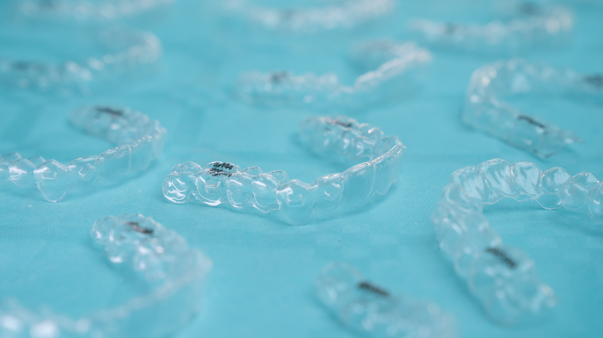
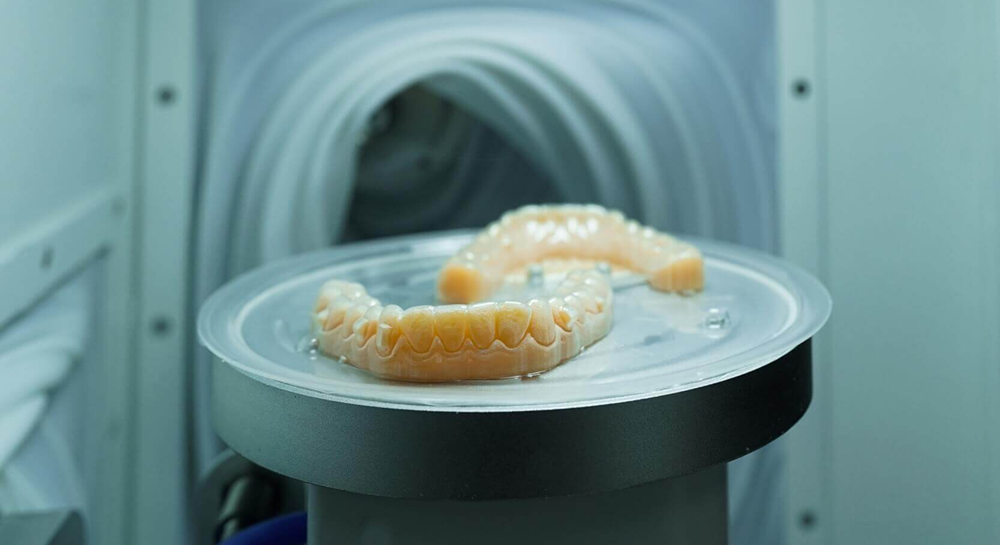
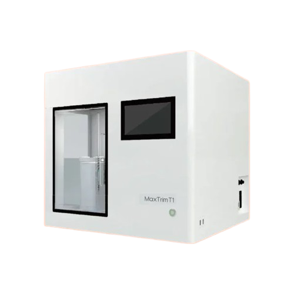
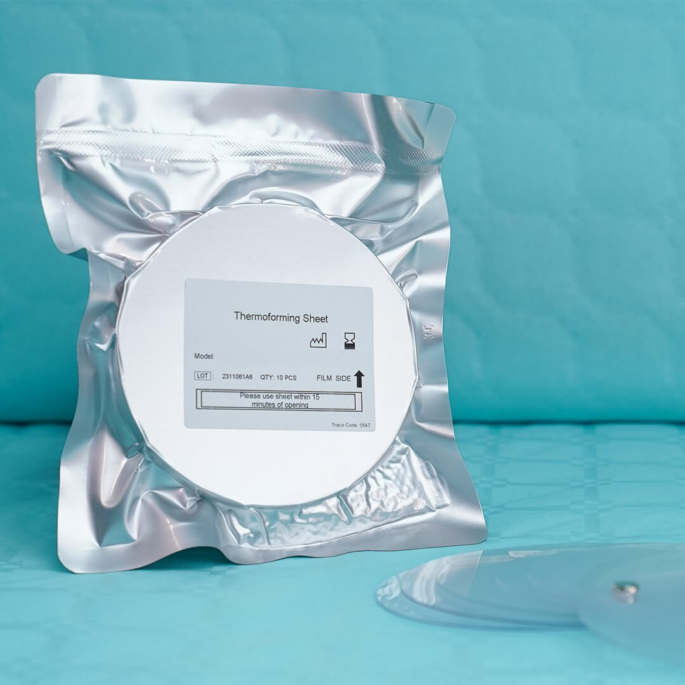
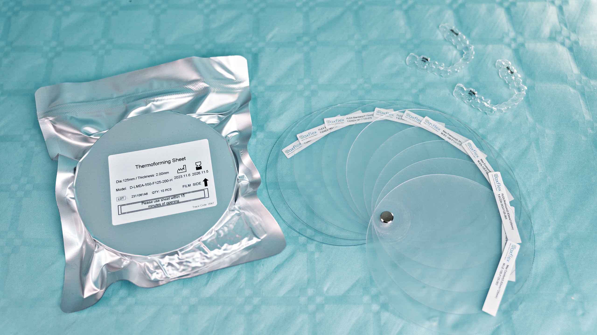

# Image Usage Report

## 📊 Summary

- **Total Image Files**: 36
- **Total Unique Images**: 35 (1 duplicate: `alignersGrid.jpg` exists in both `assets/` and `pages/home/`)
- **Used Images**: 32
- **Unused Images**: 3

---

## ✅ USED IMAGES (32)

### Page Images - About (4/4)

1. **pages/about/aboutExpo.jpg**
   

   - Used in: `client/src/pages/AboutUs.tsx`
   - Usage count: 1 time

2. **pages/about/expositionOrthoveer.jpg**
   

   - Used in: `client/src/pages/AboutUs.tsx`
   - Usage count: 1 time

3. **pages/about/factory.jpg**
   

   - Used in: `client/src/pages/CaseStudies.tsx`
   - Usage count: 1 time

4. **pages/about/thrimming.jpg**
   
   - Used in:
     - `client/src/pages/Home.tsx` (1 time)
     - `client/src/pages/CaseStudies.tsx` (1 time)
   - Usage count: **2 times** ⭐

### Page Images - Home (3/3)

5. **pages/home/alignersGrid.jpg**
   

   - Used in: `client/src/pages/Home.tsx`
   - Usage count: 1 time
   - **Note**: Duplicate exists in `assets/alignersGrid.jpg` (unused)

6. **pages/home/explicationImage.jpg**
   

   - Used in: `client/src/pages/Home.tsx`
   - Usage count: 1 time

7. **pages/home/machineImageTrim.jpg**
   
   - Used in: `client/src/pages/AboutUs.tsx`
   - Usage count: 1 time

### Page Images - Blog (3/3)

8. **pages/blog/duo.jpg**
   

   - Used in: `client/src/config/blog.ts`
   - Usage count: 1 time

9. **pages/blog/expositionTips.jpg**
   

   - Used in: `client/src/config/blog.ts`
   - Usage count: 1 time

10. **pages/blog/modelsGridImage.jpg**
    
    - Used in: `client/src/config/blog.ts`
    - Usage count: 1 time

### Page Images - Careers (1/1)

11. **pages/careers/expositionOrthoveer.jpg**
    
    - Used in: `client/src/pages/Careers.tsx`
    - Usage count: 1 time

### Page Images - White Labeling (1/1)

12. **pages/white-labeling/customBox.jpg**
    
    - Used in: `client/src/pages/WhiteLabeling.tsx`
    - Usage count: 1 time

### Hero Images (3/3)

13. **heroes/images/clear-aligner.png**
    

    - Used in: `client/src/config/blog.ts`
    - Usage count: 1 time

14. **heroes/images/dark-hero.png**
    

    - Used in:
      - `client/src/pages/AboutUs.tsx` (1 time)
      - `client/src/config/blog.ts` (1 time)
      - `client/src/pages/CaseStudies.tsx` (1 time)
    - Usage count: **3 times** ⭐ (Most used)

15. **heroes/images/tech-hero.png**
    
    - Used in: `client/src/pages/CaseStudies.tsx`
    - Usage count: 1 time

### Logo Images (1/2)

16. **logo/logo.webp**
    
    - Used in:
      - `client/src/components/layout/Navbar.tsx` (1 time)
      - `client/src/components/layout/Footer.tsx` (1 time)
    - Usage count: **2 times**

### Machine Images (9/9) - All Used

17. **machines/maxtrim-t2.png**
    

18. **machines/maxtrim-t1.png**
    

19. **machines/maxform-l2.png**
    

20. **machines/maxscan-s1.png**
    

21. **machines/maxprinter-p2.png**
    

22. **machines/maxprinter-p1.png**
    

23. **machines/maxmark-m2.png**
    

24. **machines/maxpolish-i.png**
    

25. **machines/maxpolish-ii.png**
    

- All used in: `client/src/lib/assets/index.ts` (via `machineImageMap`)
- Each used: 1 time (accessed dynamically via machine ID)
- **Note**: Folder renamed from `machinesPage/` to `machines/`

### Materials Images (3/3)

26. **materials/plastics.jpg**
    

    - Used in: `client/src/pages/PlasticsMaterials.tsx`
    - Usage count: 1 time

27. **materials/rolls.jpg**
    

    - Used in: `client/src/pages/Rolls.tsx`
    - Usage count: 1 time

28. **materials/displayPlastics.jpg**
    
    - Used in: `client/src/config/blog.ts`
    - Usage count: 1 time

### Team Images (4/4)

29. **team/abel.jpg**
    

30. **team/alexMuleng.jpg**
    

31. **team/bernard.jpg**
    

32. **team/darrellSalumay.jpg**
    

- All used in: `client/src/pages/Team.tsx`
- Each used: 1 time

---

## ❌ UNUSED IMAGES (3)

1. **assets/DoctorScanningPatient.webp**
   

   - Location: `attached_assets/assets/DoctorScanningPatient.webp`
   - Status: Not imported or referenced anywhere

2. **assets/customerPuttingAligner.webp**
   

   - Location: `attached_assets/assets/customerPuttingAligner.webp`
   - Status: Not imported or referenced anywhere

3. **logo/logo3.png**
   
   - Location: `attached_assets/logo/logo3.png`
   - Status: Not imported or referenced anywhere
   - Note: `logo.webp` is used instead

### Duplicate File (Not Counted in Totals)

- **assets/alignersGrid.jpg** - Duplicate of `pages/home/alignersGrid.jpg` (which is used)
  - Should be removed to avoid confusion

---

## 📈 Usage Statistics

### Most Used Images:

1. **dark-hero.png** - 3 times
2. **logo.webp** - 2 times
3. **thrimming.jpg** - 2 times

### Images Used Once:

- Most other images are used exactly once in their respective pages/components

### Usage by Category:

- **Pages**: 12 images (all used)
- **Heroes**: 3 images (all used)
- **Machines**: 9 images (all used)
- **Materials**: 3 images (all used)
- **Team**: 4 images (all used)
- **Logo**: 1 used, 1 unused
- **Assets**: 0 used, 3 unused (+ 1 duplicate)

---

## 📁 Folder Structure

```
attached_assets/
├── pages/                    # All page-specific images (12 images)
│   ├── home/                 # 3 images
│   ├── about/                # 4 images
│   ├── blog/                 # 3 images
│   ├── careers/              # 1 image
│   └── white-labeling/       # 1 image
├── machines/                 # Machine images (9 images)
├── materials/                # Material images (3 images)
├── team/                     # Team member images (4 images)
├── logo/                     # Logo images (2 images, 1 unused)
├── heroes/                   # Hero images & videos
│   ├── images/              # 3 images
│   └── videos/              # 3 videos
└── assets/                   # Generic/unused assets (3 unused + 1 duplicate)
```

### Path Changes (Completed):

- ✅ `aboutPage/*` → `pages/about/*`
- ✅ `homePage/*` → `pages/home/*`
- ✅ `blogPage/*` → `pages/blog/*`
- ✅ `careerPage/*` → `pages/careers/*`
- ✅ `whiteLabelingPage/*` → `pages/white-labeling/*`
- ✅ `machinesPage/*` → `machines/*`
- ✅ `assets/alignersGrid.jpg` → `pages/home/alignersGrid.jpg` (moved, but duplicate remains)

---

## 💡 Recommendations

1. **Remove unused images** to reduce bundle size:

   - `assets/DoctorScanningPatient.webp`
   - `assets/customerPuttingAligner.webp`
   - `logo/logo3.png`
   - `assets/alignersGrid.jpg` (duplicate)

2. **Consider using unused images** if they fit your design:

   - `DoctorScanningPatient.webp` could be used in AboutUs or Home page
   - `customerPuttingAligner.webp` could be used in WhiteLabeling or Home page

3. **Clean up assets folder**:
   - The `assets/` folder now only contains unused images and a duplicate
   - Consider removing it entirely after cleaning up

---

_Report generated based on codebase analysis - Last updated with accurate counts_
